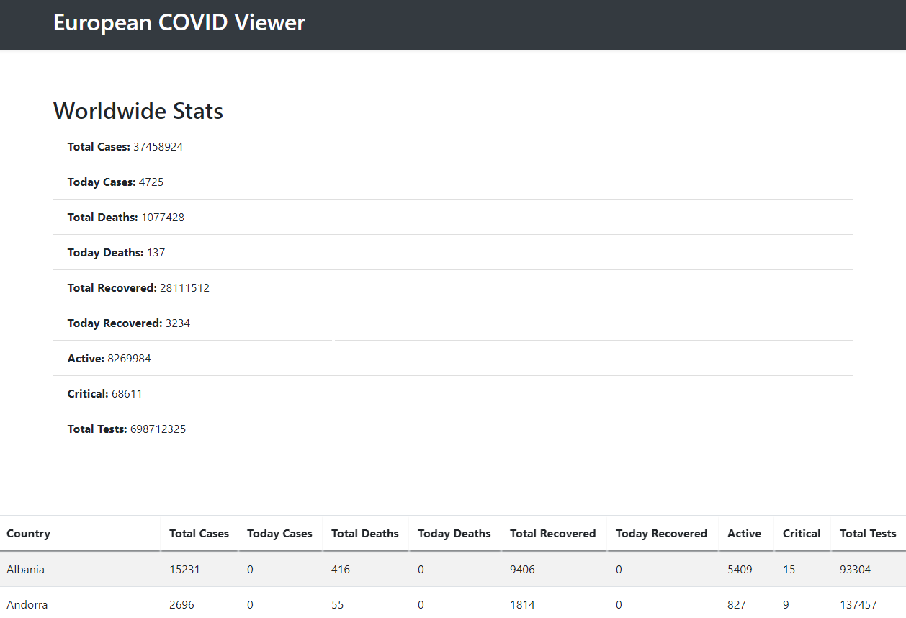

# European COVID Viewer

A simple application to display COVID data from European countries. It makes use of the [disease.sh](https://disease.sh/) API, to get the information. This application was developed using spring-boot. 

### To run the application

From the command line:

```
git clone https://github.com/hmartins15/COVIDView.git
cd COVIDView
./mvnw package
cd target
java -jar COVIDView-0.0.1-SNAPSHOT.jar
```

## Endpoints

To access the application
```
 http://localhost:8080
```


To sort the table row values 
```
 http://localhost:8080/sort+TotalCases
 http://localhost:8080/sort+TodayCases
 http://localhost:8080/sort+TotalDeaths
 http://localhost:8080/sort+TodayDeaths
 http://localhost:8080/sort+TotalRecovered
 http://localhost:8080/sort+TodayRecovered
 http://localhost:8080/sort+Active
 http://localhost:8080/sort+Critical
 http://localhost:8080/sort+Tests
```

## Built With

* [Spring-boot](https://spring.io/projects/spring-boot) - Used web framework 
* [Maven](https://maven.apache.org/) - Dependency Management
* [Thymeleaf](https://www.thymeleaf.org/) - Java HTML template engine

## Versions
* Java 8 or above
* Spring-boot 2.3.4
* Maven 3.6.3


## Authors

* **Henrique Martins**  

## License

Copyright © 2020 Henrique Martins

Permission is hereby granted, free of charge, to any person obtaining a copy of this software and associated documentation files (the “Software”), to deal in the Software without restriction, including without limitation the rights to use, copy, modify, merge, publish, distribute, sublicense, and/or sell copies of the Software, and to permit persons to whom the Software is furnished to do so, subject to the following conditions:

The above copyright notice and this permission notice shall be included in all copies or substantial portions of the Software.

THE SOFTWARE IS PROVIDED “AS IS”, WITHOUT WARRANTY OF ANY KIND, EXPRESS OR IMPLIED, INCLUDING BUT NOT LIMITED TO THE WARRANTIES OF MERCHANTABILITY, FITNESS FOR A PARTICULAR PURPOSE AND NONINFRINGEMENT. IN NO EVENT SHALL THE AUTHORS OR COPYRIGHT HOLDERS BE LIABLE FOR ANY CLAIM, DAMAGES OR OTHER LIABILITY, WHETHER IN AN ACTION OF CONTRACT, TORT OR OTHERWISE, ARISING FROM, OUT OF OR IN CONNECTION WITH THE SOFTWARE OR THE USE OR OTHER DEALINGS IN THE SOFTWARE.
